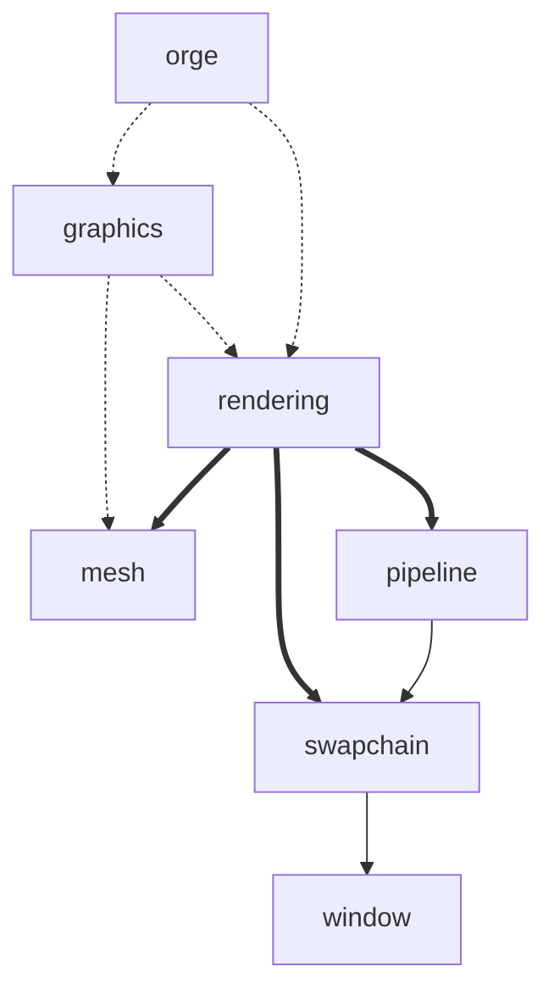

# Architecture

## Modules

```mermaid
graph TD
    orge -.-> graphics
    graphics -.-> rendering
    orge -.-> rendering
    graphics -.-> mesh
    rendering ==> swapchain
    rendering ==> pipeline
    rendering ==> mesh
    swapchain --> window
    pipeline --> swapchain
```

- 太線矢印: 依存
- 細線矢印: 参照
- 点線矢印: 転送
